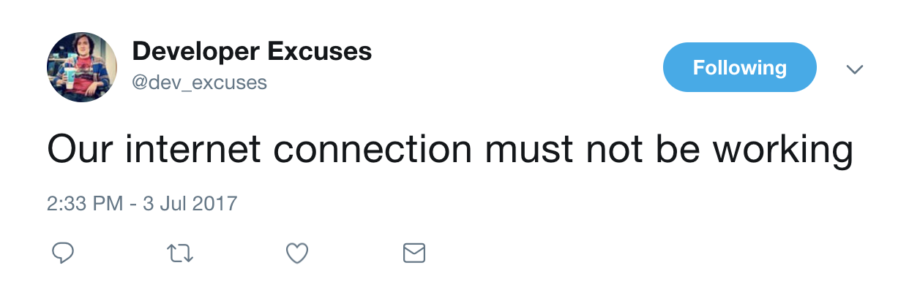

# developer-problems

`developer-problems` is a Twitter bot that tweets out random lazy developer excuses at [@dev_excuses](https://twitter.com/dev_excuses).

This Node script scrapes content from [developerexcuses.com](http://developerexcuses.com) and Tweets out each randomly generate quote.

## LOCAL SETUP

After cloning the repo, run `npm install` to pull all dependencies. Afterwards, `config.json` should be created in the root of the project (based on example structure found in `config.json.ex`) with your designated Twitter bot account's client secret + access token.

Finally, run `npm start` and your bot should have spoken! This script can be automated trivially via cronjobs or any other schedule-based automation tool.

A `fabfile.py` and `requirements.txt` can also be found, along with another example structure in `settings.py.ex`. This was configured to help me deploy changes easily to my personal server and are not required to run the project.
